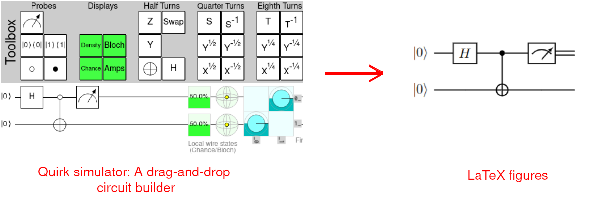
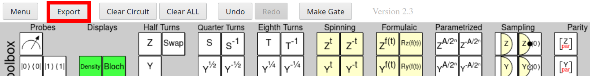
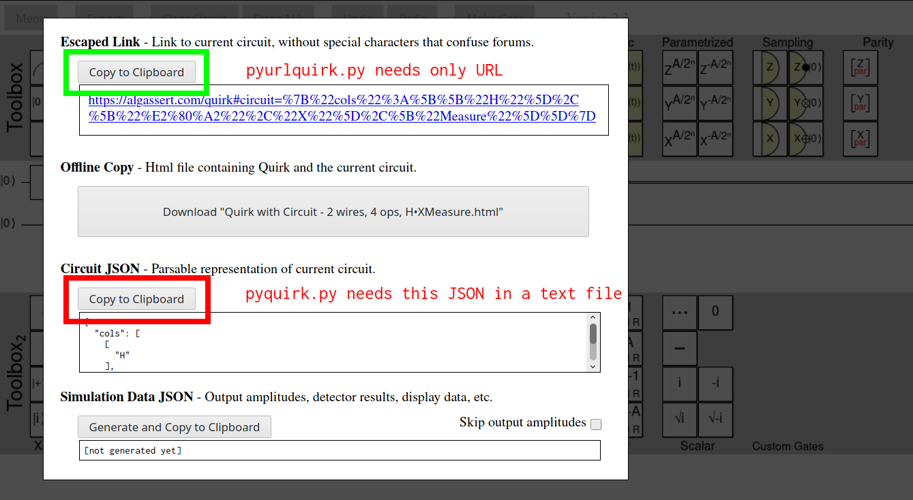

# pyquirk
A simple python program to convert graphical circuits to quantikz figures.



## Demo


## Requirements
- Python 3+
- [quantikz](https://ctan.org/pkg/quantikz?lang=en): A LaTeX package for drawing quantum circuits. Here is its [manual](http://mirrors.ibiblio.org/CTAN/graphics/pgf/contrib/quantikz/quantikz.pdf).

##### How to manually install a new package on MikTeX on Windows?
If you do not know how to manually install a new TeX package to your system, these links may be of some help to you.
- [Windows with MikTeX](https://tex.stackexchange.com/questions/2063/how-can-i-manually-install-a-package-on-miktex-windows)
- [Linux](https://tex.stackexchange.com/questions/73016/how-do-i-install-an-individual-package-on-a-linux-system)
- [Mac with TeXShop](https://tex.stackexchange.com/questions/12102/how-do-i-install-ctan-packages-on-mac-os-with-texshop)

## 💾 Installation and Usage
Clone the repo for installing. `pyquirk.py` converts URL or JSON files to quantikz circuit directly. Both produce the same output; the usage is a matter of convenience.

Copy and paste the URL from [Quirk](https://algassert.com/quirk)(a toy quantum circuit simulator) or use the JSON data of your circuit and paste it into a `.txt` file as explained below. The output is formatted into a `.tex` file.

#### Usage
The options are as shown. You may see this by using `python pyquirk.py -h`

```bash
usage: pyquirk.py [-h] [-u URL | -i INPUT] [-o OUTPUT | -m MAIN]

Generates quantikz LateX codes from either URL or a text file. Options are explained below.

optional arguments:
  -h, --help            show this help message and exit
  -u URL, --url URL     Converts Quirk URL to circuit code.
  -i INPUT, --input INPUT
                        Converts input text file with circuit in JSON format to circuit code.
  -o OUTPUT, --output OUTPUT
                        Latex code with only quantikz environment is saved in output file.
  -m MAIN, --main MAIN  A standalone LaTeX document containing the output circuit code.
```

- In case of an URL the syntax is `python3 pyquirk.py -u URL -o output.tex`. For example,

```bash
python3 pyquirk.py -u https://algassert.com/quirk#circuit=%7B%22cols%22%3A%5B%5B%22H%22%5D%2C%5B%22%E2%80%A2%22%2C%22X%22%5D%2C%5B%22Measure%22%5D%5D%7D -o circuit.tex
```

- In case of a text file containing JSON, the format is `python3 pyquirk.py -i input.txt -o output.tex`

```bash
python3 pyquirk.py -i circuit_json.txt -o circuit.tex
```

Now you may include `circuit.tex` which contains only tikz environement in `main.tex` that supplements packages. Read below for clarity. Also you may generate a standalone LaTeX file containing the code using,

```bash
python3 pyquirk.py -i input.txt -m main.tex
python3 pyquirk.py -i circuit_json.txt -m main_file.tex
```

### Steps to generate the URL or `.txt` file
**Step 1:** Click on `Export` button displayed on the header of [Quirk](https://algassert.com/quirk).



**Step 2:** `Copy to Clipboard` the URL or JSON settings.



---

**After getting `output.tex`**

A short rundown of **quantikz** usage is given below. I assume this is the format of your main file in which the circuit should be included along with descriptions, equations and stuff.

**A minimal working example:**
```latex
\documentclass{article}
\usepackage{tikz}
\usetikzlibrary{quantikz}

\begin{document}
\begin{center}      %Optional centering

%(...circuit code from the output goes here...)
% you may as well just pipe the output file of pyquirk as input:

\input{output.tex}

% or you can completely copy-paste the output of pyquirk:

\begin{quantikz}
\lstick{\ket{0}}&\gate{H} & \ctrl{1} & \meter{}& \cw \\
\lstick{\ket{0}}&\qw & \targ{} & \qw& \qw
\end{quantikz}

\end{center}
\end{document}
```
Note that the above minimal example is the content of main.tex, so you might as well use `-m` argument.

Use the example files supplied if you have more doubts. Submit an issue if you find errors or need help!

## Future improvements
- Parsing from algassert URL.
- A dedicated website for generating tex code after pasting JSON.

## Contribution
Submit a pull request. You can also DM me at [@PsintificAbhay](https://twitter.com/PsintificAbhay).

## Acknowledgement
- [Craig Gidney](https://github.com/Strilanc) for building Quirk.
- [Alastair Kay](http://www.ma.rhul.ac.uk/akay/index.php) for maintaining quantikz.

This is one of those weekend projects. May contain sharp edges! :)
